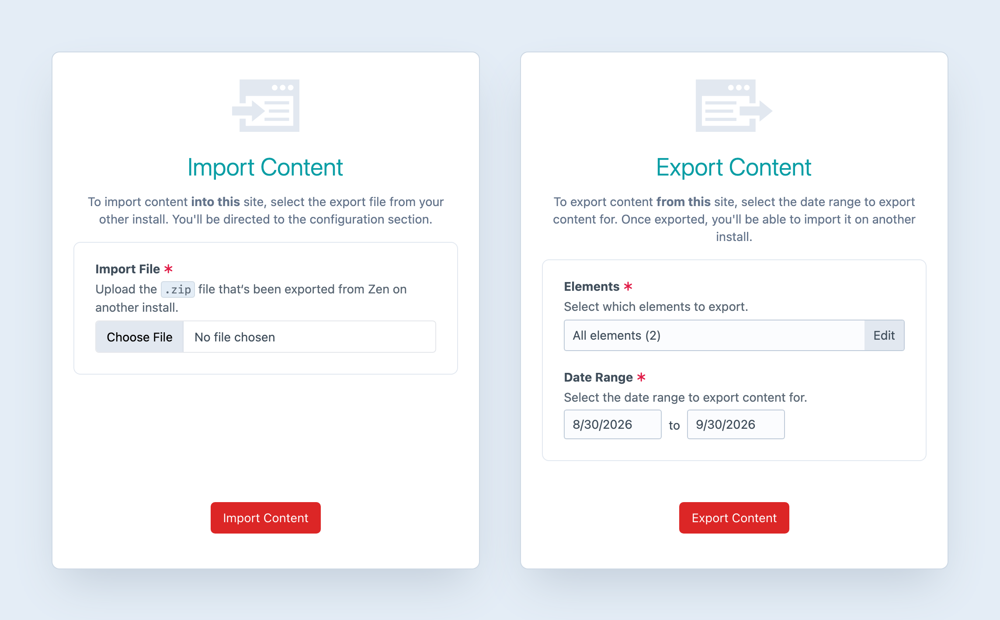
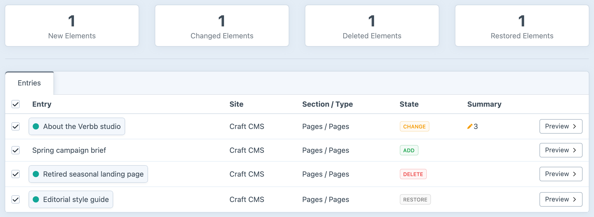

<!-- feature-intro -->
Manage content across Craft environments without the headache of copying and pasting it field by field. Export the elements you changed, review how they will map at the destination and let the queue handle the import.
<!-- feature-intro-end -->

<!-- feature-section media-size="large" -->
## Import and export, sorted

Generate an export on one environment and bring it into another through a guided configuration and review process. Choose the entries, categories and other supported elements that need to move instead of copying an entire database.

<!-- feature-section-end -->

<!-- feature-section media-size="large" -->
## Fine-grained control

Configure and review the content before starting the import. Map its destination and compare the existing and incoming element data, so there is a clear chance to resolve differences before anything is queued.

<!-- feature-section-end -->

<!-- feature-section -->
## Craft content preserved

Zen handles native Craft fields and established structured field types, with provider extension points for additional elements and fields. Background importing keeps a substantial transfer away from the web request.
<!-- feature-section-end -->
